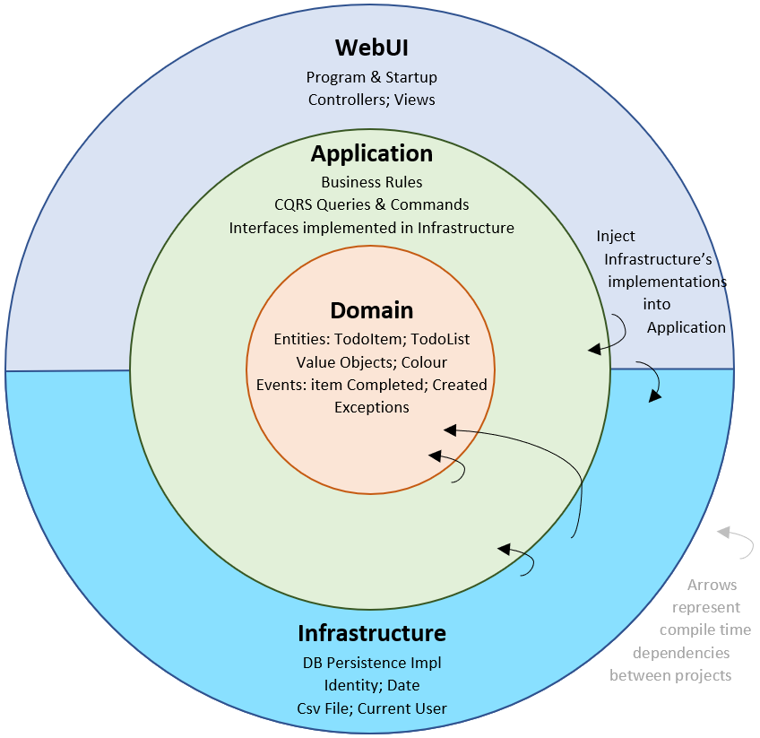

# Clean Architecture



[Image source link](https://blog.ndepend.com/clean-architecture-for-asp-net-core-solution/).

Clean Architecture is a software design pattern created by Robert C. Martin (commonly known as Uncle Bob). It aims to build maintainable, scalable, and flexible systems by separating concerns and enforcing strict boundaries between different layers of the application. This architectural style is particularly beneficial in ASP.NET Core applications due to its modular nature.

In this article, we'll dive into Clean Architecture and how to implement it in an ASP.NET Core application.

# Terms of Clean Architecture

## 1. Business Logic

Business logic refers to the rules, constraints, and procedures that govern how the business operates. It is specific to the problem domain and defines what the system needs to do from a business perspective. Business logic is usually independent of the technical details of an application and focuses on the core functions that are directly tied to achieving business goals.

### Characteristics of Business Logic:

- **Defines business rules:** Rules that describe how certain actions or processes should be handled. For example, calculating tax, processing an order, or validating a customer’s eligibility for a loan.

- **Specific to the domain:** Business logic is directly tied to the domain in which the application operates (e.g., finance, healthcare, e-commerce).

- **Independent of technology:** It doesn't depend on the infrastructure, UI, or data sources. It purely focuses on the business aspects and can often be reused across different technologies.

**Example:** In an e-commerce application, business logic would include rules such as:

- Free shipping for orders over $100.
- A discount that applies to loyalty customers who have made more than 10 purchases.

```csharp
public class Order
{
   public decimal TotalAmount { get; set; }

   public bool IsEligibleForFreeShipping(){
      return TotalAmount > 100;
   }
}
```

## 2. Application Logic

Application logic (or application service logic) refers to the technical implementation details of how the system should accomplish the business requirements. It deals with how the application functions as a whole, managing workflows, interactions between components, and interfacing with external systems such as databases, APIs, or the user interface.

Application logic coordinates the execution of business logic and handles infrastructure concerns like persistence, communication with external services, and user input/output.

### Characteristics of Application Logic:

- **Coordinates business operations:** It manages the flow of data between the user interface, data access, and business logic.

- **Handles system workflows:** Deals with external communication, saving data to a database, sending emails, or routing requests.

- **Dependent on infrastructure and framework:** Application logic is closely tied to the framework or platform (e.g., ASP.NET Core) and the system architecture.

**Example:** In the same e-commerce application, application logic would handle:

- Creating an order and saving it to the database.
- Sending an email confirmation to the customer.
- Calling third-party APIs to process payments.

```csharp
public class OrderService
{
    private readonly IOrderRepository _orderRepository;
    private readonly IEmailService _emailService;

    public OrderService(IOrderRepository orderRepository, IEmailService emailService)
    {
        _orderRepository = orderRepository;
        _emailService = emailService;
    }

    public void PlaceOrder(Order order)
    {
        _orderRepository.Save(order); // Application logic
        _emailService.SendOrderConfirmation(order); // Application logic
    }
}

```

### Key Differences Between Application Logic And business Logic

| Aspect          | Business Logic                            | Application Logic                                   |
| --------------- | ----------------------------------------- | --------------------------------------------------- |
| Focus           | What the system does (business rules)     | How the system works (technical implementation)     |
| Domain Specific | Yes, tied to business goals and processes | No, tied to infrastructure and technology           |
| Independence    | Independent of technology and framework   | Dependent on infrastructure, frameworks, and tools  |
| Examples        | Calculating discounts, validating orders  | Handling HTTP requests, saving data to the database |

Business logic focuses on defining **what** the system should do from a business perspective, while application logic deals with **how** the system achieves those goals by coordinating components, handling workflows, and managing the technical implementation. Separating these two ensures that business rules remain consistent across different platforms and that the application is more maintainable, testable, and scalable.

## 3. Use Case

A use case is a term used in software development and system design to describe specific interactions between a user (or another system) and the system that lead to achieving a particular goal. It represents a single functional requirement or scenario that the system must fulfill from the user's perspective.

### Key Aspects of a Use Case

1. **User or Actor:**

   - The "actor" is the person or system that interacts with the software to accomplish something. In many cases, the actor is a user, but it could also be an external system or another service.

2. **Goal or Objective:**

   - A use case describes what the actor wants to achieve. For instance, in an e-commerce application, a user might want to place an order, add items to the shopping cart, or track an existing order.

3. **System Interaction:**

   - The use case defines how the actor interacts with the system and the series of actions or steps the system takes to fulfill the goal. It outlines input, process, and output in that particular scenario.

4. **Functional Requirement:**
   - Each use case is essentially a functional requirement—something the system must be able to do to meet user needs. It's not about technical implementation but focuses on the interaction and outcome.

### Example of a Use Case

In an online shopping system, one possible use case might be "Place an Order."

- **Actor:** The customer (user).
- **Goal:** The customer wants to place an order for a product.
- **Interaction:**

  1.  The customer browses the product catalog.
  2.  The customer adds items to the shopping cart.
  3.  The customer proceeds to the checkout.
  4.  The system prompts for payment and shipping information.
  5.  The customer enters the necessary details and confirms the order.
  6.  The system processes the payment and provides an order confirmation.

### Types of Use Cases

1. **High-level Use Case (Abstract or Brief Use Case):**

   - Focuses on **what** the system does. It’s a simplified summary of a user action.
   - Example: "User adds a product to the shopping cart."

2. **Detailed Use Case (Concrete Use Case):**
   - Describes **how** the system responds in detail, often including every possible step, interaction, and alternative paths.
   - Example: A detailed breakdown of the steps involved in adding a product, handling errors (like if the product is out of stock), etc.

### Use Case in Clean Architecture

In the context of Clean Architecture, a use case refers to the specific business functionality that is part of the application’s application logic layer. The use case orchestrates interactions between the business logic (core) and infrastructure to fulfill a particular goal.

For example, in Clean Architecture:

- It includes the business rules (validations) and coordinates the steps, like saving the new customer to a repository and sending a welcome email.

- It abstracts the high-level goal but hides the underlying technical details of how the customer data is saved or emails are sent.
  **Use Case:** "Register a Customer"

```csharp
public class RegisterCustomerUseCase
{
    private readonly ICustomerRepository _customerRepository;
    private readonly IEmailService _emailService;

    public RegisterCustomerUseCase(ICustomerRepository customerRepository, IEmailService emailService)
    {
        _customerRepository = customerRepository;
        _emailService = emailService;
    }

    public void RegisterCustomer(string name, string email)
    {
        var customer = new Customer { Name = name, Email = email };
        _customerRepository.Add(customer);
        _emailService.SendWelcomeEmail(email);
    }
}

```

### Conclusion

A **use case** defines how an actor interacts with a system to achieve a specific goal. It captures a functional requirement in the form of user actions and system responses, focusing on what needs to happen rather than **how** it's technically implemented. In Clean Architecture, use cases encapsulate application logic to coordinate interactions between the business logic and external systems, helping to maintain clear separation between different layers of the application.

## Goals of Clean Architecture

The primary goal of Clean Architecture is to separate the system’s structure into loosely coupled layers, enabling high maintainability and scalability. Its key objectives include:

- **Independence of frameworks:** The system shouldn't depend on the framework but rather allow the framework to serve as a delivery mechanism for the core.

- **Testability**: Business logic should be testable without needing to rely on external dependencies like databases, APIs, or frameworks.

- **Independence of UI and database:** Changes to the UI or database shouldn't affect the core business logic.

- **Separation of concerns:** Each layer should have a distinct responsibility, avoiding the mixing of business logic, data access, and presentation.

## Overview of Clean Architecture Layers

Clean Architecture organizes the system into concentric layers, with the innermost layer being the most critical (core business logic) and the outermost being the least. Here's a breakdown of these layers:

1. **Entities (Domain Layer)**

   - These are the core business objects and rules. They are the most independent part of the application.

   - This layer contains **domain models** (e.g., `Customer`, `Order`) and **business logic specific to your system**.

2. **Use Cases (Application Layer)**

   - This layer contains the application logic specific to use cases. It communicates with the domain layer to perform operations such as adding a new customer, processing an order, etc.

   - Use cases should be decoupled from the database, UI, and external systems.

   - Example: Services, input/output port interfaces for application tasks.

3. **Interface Adapters (Infrastructure Layer)**

   - This layer contains all the adapters needed to communicate with external systems such as databases, APIs, or message brokers.

   - It also includes **repositories**, **controllers**, and **mappers** that convert data between the domain and external layers.

4. **Framework and External Systems (Presentation Layer)**

   - The outermost layer is where frameworks, UI, and external systems like databases or APIs reside.

   - ASP.NET Core MVC, Razor Pages, or API controllers belong here, as they serve as delivery mechanisms for the core logic.

The idea is to have dependencies pointing inward. For example, the outer layers (UI, infrastructure) depend on the application and domain layers, _but not vice versa_.

```sql
+-------------------------------------------+
|           External Systems/UI             |
|          (Frameworks/Controllers)         |
+----------------------+--------------------+
                       |
            +----------+----------+
            |  Infrastructure/IO  |
            |    (Adapters)       |
            +----------+----------+
                       |
         +-------------+--------------+
         |    Application/Use Cases   |
         +-------------+--------------+
                       |
            +----------+-----------+
            |     Domain/Entities  |
            +----------------------+

```

## Implementing Clean Architecture in ASP.NET Core

### Step 1: Project Structure

To implement Clean Architecture, the project structure should reflect the separation of concerns. Below is a common project structure for ASP.NET Core applications using Clean Architecture:

```
/solution (sln)
  /WebUI                // ASP.NET Core project (presentation layer)
  /Application          // Use cases and services (application layer)
  /Domain               // Core business logic (domain layer)
  /Infrastructure       // Data access, repositories, external integrations (infrastructure layer)

```

### Step 2: Domain Layer

In the Domain project, you define the core entities and business rules. These are plain C# classes that encapsulate the logic and validation related to your domain.

```csharp
// Domain/Entities/Customer.cs
public class Customer
{
    public int Id { get; set; }
    public string Name { get; set; }

    public void UpdateName(string newName)
    {
        if (string.IsNullOrEmpty(newName))
            throw new ArgumentException("Name cannot be empty.");

        Name = newName;
    }
}

```

### Step 3: Application Layer

The Application project defines use cases and services. It contains interfaces for repositories, DTOs (Data Transfer Objects), and application logic.

```csharp
// Application/Interfaces/ICustomerRepository.cs
public interface ICustomerRepository
{
    Customer GetById(int id);
    void Add(Customer customer);
}

// Application/Services/CustomerService.cs
public class CustomerService
{
    private readonly ICustomerRepository _customerRepository;

    public CustomerService(ICustomerRepository customerRepository)
    {
        _customerRepository = customerRepository;
    }

    public void RegisterCustomer(string name)
    {
        var customer = new Customer { Name = name };
        _customerRepository.Add(customer);
    }
}

```

### Step 4: Infrastructure Layer

In the Infrastructure project, you'll implement interfaces from the application layer, such as repositories, and handle external concerns (e.g., databases, APIs).

```csharp
// Infrastructure/Repositories/CustomerRepository.cs
public class CustomerRepository : ICustomerRepository
{
    private readonly ApplicationDbContext _context;

    public CustomerRepository(ApplicationDbContext context)
    {
        _context = context;
    }

    public Customer GetById(int id)
    {
        return _context.Customers.Find(id);
    }

    public void Add(Customer customer)
    {
        _context.Customers.Add(customer);
        _context.SaveChanges();
    }
}

```

### Step 5: Presentation Layer (Web UI)

Finally, the WebUI project contains the ASP.NET Core controllers that handle HTTP requests and responses. These controllers will interact with the application layer to execute business logic.

```csharp
   // WebUI/Controllers/CustomerController.cs
[ApiController]
[Route("api/[controller]")]
public class CustomerController : ControllerBase
{
    private readonly CustomerService _customerService;

    public CustomerController(CustomerService customerService)
    {
        _customerService = customerService;
    }

    [HttpPost]
    public IActionResult RegisterCustomer([FromBody] string name)
    {
        _customerService.RegisterCustomer(name);
        return Ok("Customer registered successfully.");
    }
}

```
